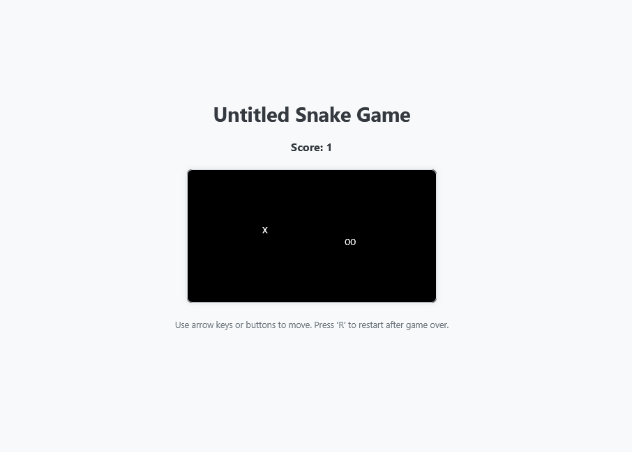
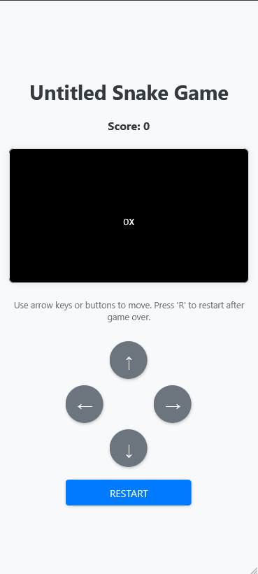
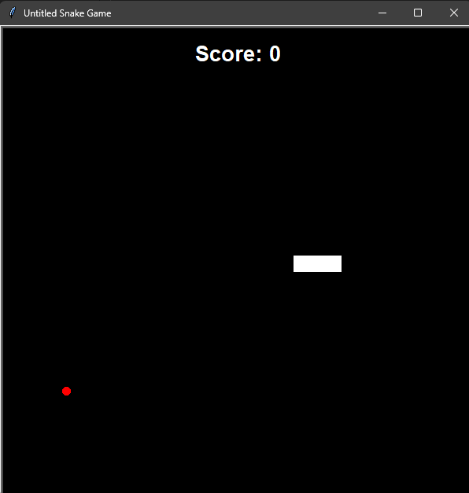

# Untitled Snake Game

## Project Overview
This repository contains two implementations of the classic Snake game:
1. A Python implementation using the Turtle graphics library
2. A web-based version using HTML, CSS, JavaScript, and Pyodide (Python running in the browser)

## Web Version

### Overview
The web implementation brings the game to browsers using HTML, CSS, and JavaScript, with Python code running through Pyodide. This version offers the same gameplay experience but is accessible through any modern web browser without requiring Python installation.

### Technologies Used
- HTML/CSS: For the user interface and styling
- JavaScript: For browser interaction and game loop management
- Pyodide: WebAssembly-based Python runtime that allows Python code to run in the browser
- Python: Core game logic

### Files
- `index.html`: Contains the complete game implementation including HTML structure, CSS styling, and JavaScript code that interfaces with Python

### Features
- Responsive design that works on both desktop and mobile devices
- On-screen touch controls for mobile play
- Same core gameplay as the Python version

### How to Run
1. Open the `index.html` file in a web browser
2. Alternatively, host the files on a web server to play online

### Controls
- **Desktop:** Use arrow keys for movement, 'R' key to restart
- **Mobile:** Use the on-screen directional buttons to move, tap the RESTART button to start a new game

## Python Turtle Version

### Overview
The Python implementation uses the Turtle graphics library to create a simple yet engaging snake game. The snake grows as it eats food, with a scoreboard tracking the player's progress. The game ends if the snake hits the wall or itself.

### Installation
To run the Turtle version, you need Python installed on your system. No additional libraries are required as it uses the built-in turtle module for graphics.

### Files
- `turtle/snake.py`: Defines the Snake class with methods to create and move the snake
- `turtle/food.py`: Defines the Food class, representing the food for the snake
- `turtle/scoreboard.py`: Defines the Scoreboard class to display the current score and game over message
- `turtle/main.py`: The main script that sets up the game environment and contains the game loop

### Gameplay
- The snake moves continuously in the window
- Use the arrow keys to change direction
- Eating food will increase the snake's length and the score
- The game ends if the snake collides with the wall or itself

## Differences Between Versions
While both versions offer the same core gameplay, there are some implementation differences:
- The Turtle version runs as a native Python application
- The web version runs Python code in the browser using Pyodide
- The web version includes mobile-friendly controls
- Visual styling differences exist between the versions

## Future Improvements
- Add difficulty levels
- Implement high score tracking
- Add sound effects
- Create additional game modes